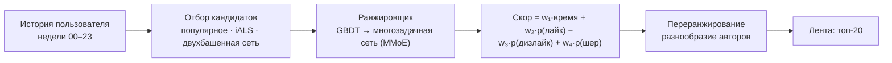

<div align="center">

# vk-feed-recsys

### Рекомендательная система ленты коротких видео ВК: ранжирование не только по времени просмотра

**Годовой проект · магистратура «Искусственный интеллект», ФКН НИУ ВШЭ · 2026/27 · трек ML**

[](https://www.python.org/)
[](https://huggingface.co/datasets/deepvk/VK-LSVD)
[](#план-работы)
[](#план-работы)

</div>

---

## Тема

**Beyond Watch Time: многоцелевое ранжирование ленты коротких видео.**

Рекомендательные ленты обычно учатся максимизировать время просмотра. Но досмотренный клип — не всегда понравившийся: человек может досмотреть и поставить дизлайк, а лайкнуть то, что пролистал на половине. В проекте строится лента клипов ВК на открытых данных, которая ранжирует не по одному предсказанному времени, а по сводному скору «время + лайки − дизлайки + разнообразие авторов», и на отложенной неделе измеряется цена такого размена.

Решение повторяет устройство боевой ленты в миниатюре: отбор кандидатов → ранжировщик → переранжирование.

## Команда и куратор

| Роль | Кто |
|---|---|
| Студент (команда из одного человека) | **Алексей Шашлов** — аналитик Ленты VK; данные, модели, сервис |
| Куратор | **Хамрин** |

## Образ результата

К июню 2027 на столе лежат три вещи:

1. **Сервис.** `GET /recommend/{user_id}?k=20&profile=quality` отдаёт ленту из 20 клипов с предсказаниями по каждой цели (время, лайк, дизлайк, шер) и итоговым скором. Профиль `watch_time` / `balanced` / `quality` переключает веса целей — для одного пользователя списки получаются разными.
2. **Таблица стратегий** на тестовой неделе: популярное · iALS · GBDT «только время» · GBDT многоцелевой · нейросеть многоцелевая · + переранжирование по авторам — по колонкам NDCG@20, время на лист, лайков и дизлайков на 1000 показов, авторов в топ-20, Джини показов по авторам.
3. **График размена** «время ↔ удовлетворённость» с точками-весами, из которого читается главный вывод года.

Проект удался, если лента собирается от сырого лога до ответа сервиса одной командой; многоцелевой ранжировщик лучше базы «только время» по лайкам, дизлайкам и разнообразию при потере времени не больше заданного порога; нейросеть честно сравнена с GBDT на одних кандидатах и признаках.

## Данные

[**VK-LSVD**](https://huggingface.co/datasets/deepvk/VK-LSVD) — открытый датасет VK (Apache-2.0, [статья WWW'26](https://arxiv.org/abs/2602.04567)): 10 млн пользователей, 20 млн клипов, 40 млрд взаимодействий за 6 месяцев понедельными файлами.

| Что | Поля |
|---|---|
| Взаимодействие | `user_id`, `item_id`, `timespent` (с), `like`, `dislike`, `share`, `bookmark`, `click_on_author`, `open_comments`, контекст `place` / `platform` / `agent` |
| Пользователь | возраст, пол, гео |
| Клип | автор, длительность, контентный эмбеддинг (64 измерения) |

Рабочий срез — `subsamples/up0.01_ir0.01`: 100 тыс. самых активных пользователей × 1 % случайных клипов, 38 млн строк. Недели 00–23 — обучение, 24 — подбор, 25 — тест. Клипы и пользователи обезличены до номеров; данные в репозиторий не кладутся, скачиваются скриптом.

## Как устроено решение



- **Позитив** для ранжирующих метрик: лайк, шер, закладка, переход к автору или досмотр (`timespent ≥ min(0.8·duration, 30 с)`, порог уточняется на EDA). **Негатив:** до 3 с без реакций или дизлайк.
- **Цели моделей:** p(лайк), p(дизлайк), p(шер или закладка), E[доля досмотра]. Веса в скоре перебираются → фронт Парето.
- **Протокол:** признаки только по прошлым неделям, случайной разбивки нет; 200 кандидатов на пользователя → ранжировщик → топ-20.

## Метрики

| Группа | Метрики |
|---|---|
| Ранжирование | NDCG@20, Recall@20 по позитивам; Recall@200 отдельно для отбора |
| По целям | ROC-AUC / logloss для лайка и дизлайка, RMSE доли досмотра |
| Лента (топ-20) | ожидаемое время, лайков и дизлайков на 1000 показов, число авторов, Джини показов по авторам |

## План работы

Все сдачи — за три дня до дедлайна. Статусы: ✅ сделано · 🔄 в работе · ⬜ впереди.

| № | Чекпойнт | Дедлайн | Что делаем | Статус |
|---|---|---|---|---|
| 1 | **Старт и планирование** | 06.10.2026 | Тема, куратор, план; репозиторий и README; скрипт скачивания среза | ✅ |
| 2 | **EDA** | 27.10.2026 | Хвосты по пользователям, клипам, авторам и Джини; частоты семи сигналов; время против реакций (главный вопрос: время ≠ удовольствие?); `timespent/duration` и потолок 255 с; контекст показа; динамика по неделям и жизненный цикл клипа; доля холодных в тестовой неделе; выводы → цели и метрики | ⬜ |
| 3 | **Первые ML-модели** | 27.11.2026 | Протокол оценки и модуль метрик; базы «случайная», «популярное», iALS; кандидаты + CatBoost на цель «позитив» с простыми признаками; сэмплирование негативов, чистка ботов, Optuna; таблица результатов | ⬜ |
| 4 | **ML-сервис** | 15.12.2026 | FastAPI (`/recommend`, `/score`, `/health`), pydantic-схемы, загрузка артефактов при старте, Docker, pytest, логирование. Совмещён с ДЗ по «Инструментам разработки» | ⬜ |
| — | **Промежуточная защита** | 10–15.01.2027 | Задача, данные, два факта из EDA, таблица баз и GBDT, сервис с одной целью, план на весну | ⬜ |
| 5 | **Улучшение модели** | 15.03.2027 | Отдельные модели на лайк, дизлайк, шер/закладку, долю досмотра → взвешенный скор и фронт Парето; сложные негативы; история как средний эмбеддинг, близость к автору; переранжирование по авторам (MMR, квота) | ⬜ |
| 6 | **Нейронные сети** | 05.05.2027 | Двухбашенная сеть для отбора против iALS; многозадачный ранжировщик MMoE против GBDT на тех же кандидатах и признаках; выводы, где сеть окупается | ⬜ |
| 7 | **Финальные доработки** | до защиты | MLflow по всем запускам, конфиги, seeds, lock-файл, Makefile; переобучение лучшей модели; анализ ошибок по сегментам (активность, популярность клипа, платформа, неделя); устойчивость (сдвиг по времени, абляции, шум) | ⬜ |
| — | **Итоговая защита** | 13–20.06.2027 | Демо сервиса в двух профилях, таблица стратегий, график размена | ⬜ |

<details>
<summary>Понедельный план первого семестра</summary>

| Неделя | К концу недели |
|---|---|
| 06–12.10 | Репозиторий, README, срез скачан и открывается, карточка данных |
| 13–19.10 | EDA-1: хвосты, Джини по авторам, частоты сигналов, `place` / `platform` |
| 20–26.10 | EDA-2: время против реакций, динамика по неделям, холодные; отчёт — **сдать 24.10** |
| 27.10–02.11 | Код протокола оценки, базы «случайная» и «популярное» |
| 03–09.11 | iALS; Recall@200 и метрики листа |
| 10–16.11 | Признаки v1, обучающая выборка, CatBoost на цель «позитив» |
| 17–23.11 | Optuna, чистка, абляции, таблица — **сдать 24.11** |
| 24–30.11 | FastAPI: схемы, артефакты, `/recommend`, `/score`, тесты |
| 01–07.12 | Docker, логирование, README с примерами — **сдать 12.12** |
| 08–14.12 | Запас на долги |
| 15.12–10.01 | Презентация к промежуточной защите; задел — вторая цель (дизлайк) |

</details>

## Структура репозитория

```
vk-feed-recsys/
├── README.md
├── data/            # срез VK-LSVD, скачивается скриптом (в git не входит)
├── notebooks/       # 01_eda, 02_baselines, 03_multiobjective, ...
├── src/             # данные, признаки, модели, оценка
├── service/         # FastAPI-сервис
├── configs/         # параметры экспериментов
├── tests/
└── reports/         # отчёты по чекпойнтам и презентации
```

## Запуск

```bash
git clone https://github.com/ShashlovAI/vk-feed-recsys.git
```

Остальное появится к чекпойнту 4. Целевой вид:

```bash
make data       # скачать срез
make features   # собрать признаки по неделям
make train      # обучить модели
make eval       # посчитать таблицу стратегий на тестовой неделе
make serve      # поднять сервис на http://localhost:8000
```

## Ссылки

- [VK-LSVD на Hugging Face](https://huggingface.co/datasets/deepvk/VK-LSVD) · [статья](https://arxiv.org/abs/2602.04567)
- [KuaiRand](https://kuairand.com/) — запасной датасет со случайными показами для несмещённой оценки
